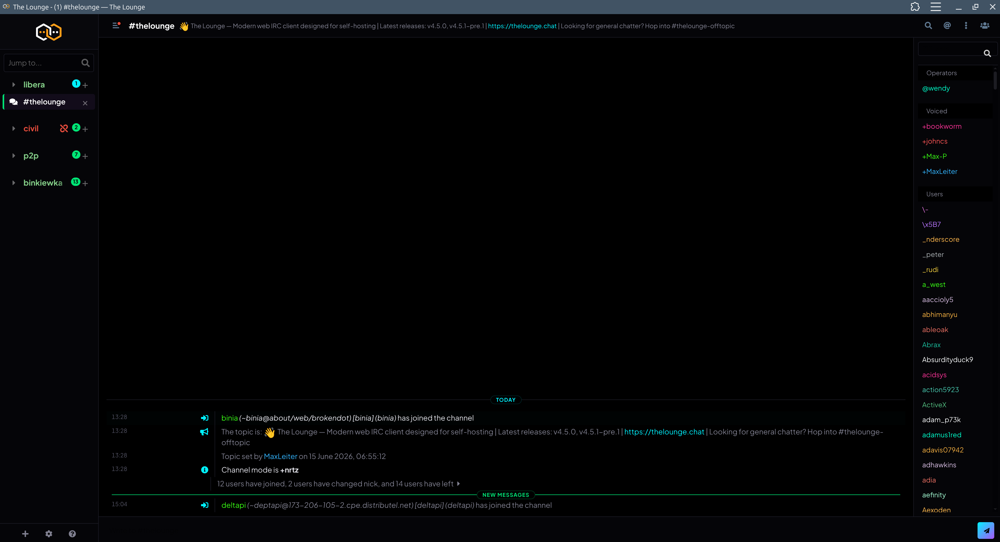
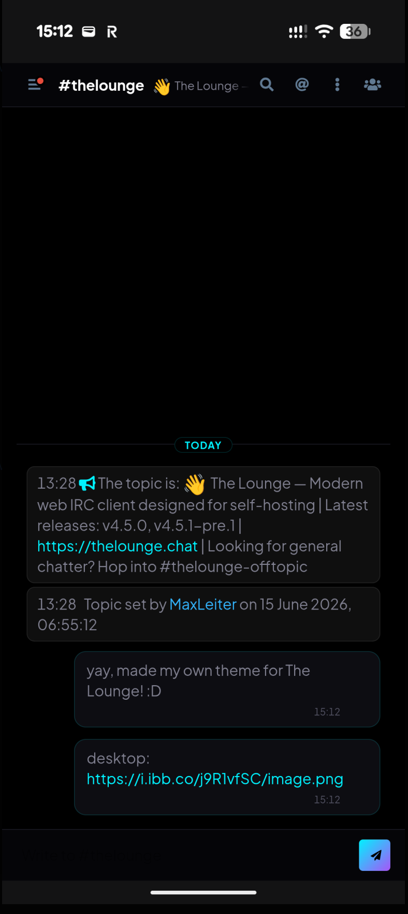

# Obsidian Veil

A premium **AMOLED-black dark theme** for [The Lounge](https://thelounge.chat) IRC client.

Compact desktop layout with a continuous nick/message separator, mobile chat bubbles, and cyber-neon accents.

---

## Screenshots

### Desktop


### Mobile


---

## Features

- **Pure AMOLED black** (`#000`) canvas — perfect for OLED displays
- **Cyber Cyan** (`#00f2ff`) & **Electric Purple** (`#a855f7`) neon accents
- **Emerald Green** notification badges that fit and pop
- **Compact desktop layout** with a continuous vertical separator line between nicks and messages
- **Mobile chat bubbles** — card-based messages with left/right alignment for incoming/outgoing
- **Joins/quits hidden on mobile** — status noise is completely removed on small screens
- **Topic & error messages** remain visible on mobile in subtle dark bubbles
- **Plus Jakarta Sans** + **JetBrains Mono** typography via Google Fonts
- **Dark user list & header** — fully themed, no bright-white bars

---

## Installation

### Via The Lounge CLI (recommended)

```bash
thelounge install thelounge-theme-obsidian-veil
```

### Via npm (if running The Lounge from source)

```bash
cd ~/.thelounge/packages
npm install thelounge-theme-obsidian-veil
```

### Docker

```bash
docker exec -it thelounge thelounge install thelounge-theme-obsidian-veil
```

The theme installs to your volume-mounted `~/.thelounge/packages/` directory and persists across container recreations.

### Manual

1. Clone or download this repository
2. Copy the folder into your The Lounge packages directory:
   ```bash
   cp -r thelounge-theme-obsidian-veil ~/.thelounge/packages/node_modules/
   ```
3. Add the theme to `~/.thelounge/packages/package.json`:
   ```json
   {
     "private": true,
     "dependencies": {
       "thelounge-theme-obsidian-veil": "1.0.0"
     }
   }
   ```
4. Restart The Lounge

---

## Activating

1. Open **Settings** → **Appearance**
2. Select **Obsidian Veil** from the theme dropdown
3. Done!

---

## Design Tokens

| Token | Value | Usage |
|---|---|---|
| `--body-bg-color` | `#000000` | Main canvas (AMOLED black) |
| `--link-color` | `#00f2ff` | Cyber Cyan — links, accents |
| `--unread-marker-color` | `#00e676` | Emerald Green — badges, unread markers |
| `--highlight-bg-color` | `rgba(0,242,255,0.08)` | Highlight glow |
| `--border-color` | `#1a1a24` | Subtle dark borders |
| `--body-color` | `#e2e2e9` | Primary text |
| `--body-color-muted` | `#808090` | Muted/secondary text |
| `--time-color` | `#555566` | Timestamps |

---

## Contributing

Contributions are welcome! Feel free to open an issue or submit a pull request.

---

## License

[MIT](LICENSE)
